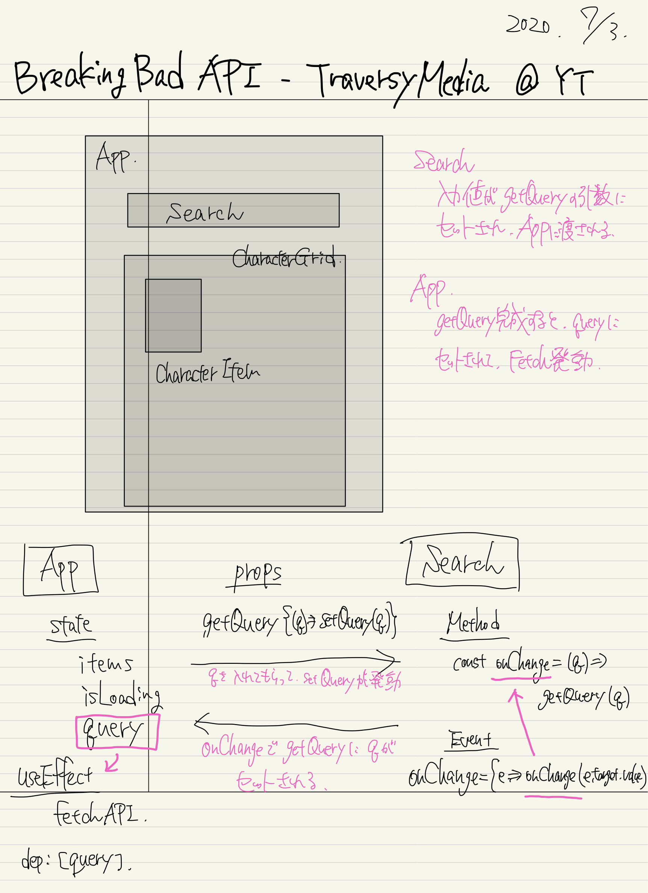

# React App - Breaking Bad API

:arrow_forward: [Breaking Bad API](https://www.youtube.com/watch?v=YaioUnMw0mo&t=277s)

---

> データフェッチしてきて、表示する
>
> :white_check_mark: input -> query -> fetch 流れどうするか？
>
> :question: ページ更新時、query なしでも一覧が表示されるのはなぜ？
